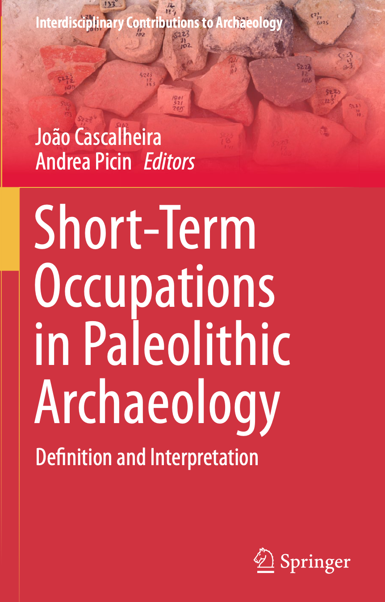
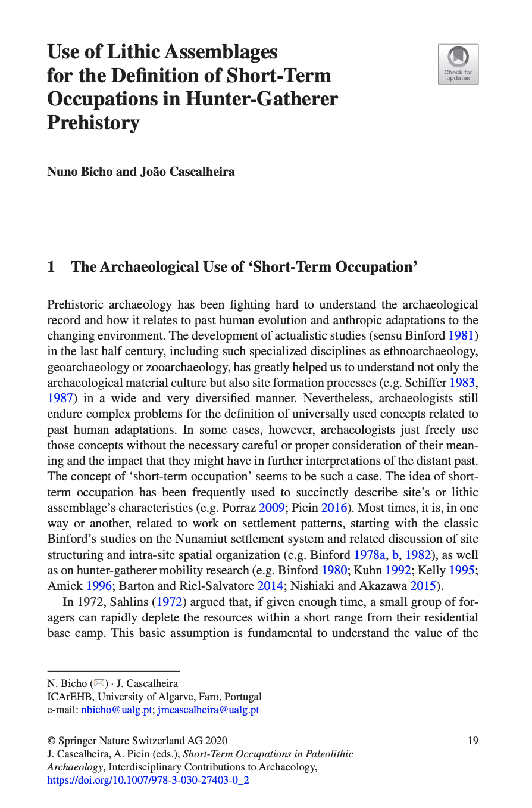

```{r setup, include = F}
# This is the recommended set up for flipbooks
# you might think about setting cache to TRUE as you gain practice --- building flipbooks from scratch can be time consuming
knitr::opts_chunk$set(fig.width = 6, 
                      message = FALSE, 
                      warning = FALSE, 
                      comment = "", 
                      cache = FALSE, 
                      fig.retina = 3)
library(flipbookr)
library(tidyverse)
library(fontawesome)
library(countdown)

# reference on how to do things
# https://evamaerey.github.io/little_flipbooks_library/flipbookr/skeleton
# https://arm.rbind.io/slides/xaringan.html
# images from https://unsplash.com/
# my infer ex. https://gist.github.com/benmarwick/6e17b6435ffb811f6deb4586d36c5282
# slides by Chester: https://ismayc.github.io/talks/infer-useR/slide_deck.html#1
```

class:  center, left

.pull-left[

]


.pull-right[
# Find me at...
.left[
[`r fa(name = "twitter")` @benmarwick](http://twitter.com/benmarwick)  
[`r fa(name = "github")` @benmarwick](http://github.com/benmarwick)  
[`r fa(name = "link")` faculty.washington.edu/bmarwick](http://faculty.washington.edu/bmarwick)  
[`r fa(name = "paper-plane")` bmarwick@uw.edu](mailto:bmarwick@uw.edu)
]
]

---

# Welcome

- Statistical inference is the process of making conclusions from a sample of data

--

- One kind of statistical inference is hypothesis testing, where we use a sample of data to determine the strength of evidence for or against our theory

--

- Data exploration is searching for patterns, groups and characteristics in our sample

--

- We are going to do statistical inference and data exploration using the tidyverse (to catch up, see [tidyverse for archaeologists](https://github.com/benmarwick/tidyverse-for-archaeology))

--

- When we write R code to analyse archaeological data, our analysis is **transparent and reproducible**. These are two vital characteristics of good scientific work. 

--

- We should **share our code and data** with our research publications for others to study and learn

---

# What are we going to do today?

I will demonstrate and you will practice...

--

- Hypothesis testing: chi-square, t-test, ANOVA

--

- Exploration: Principal Components Analysis  

--

- Exploration: k-means clustering   

---

class: center, middle 

# Let's import some archaeological data 💽

---

class: left, middle

background-image: url(figures/data-source-paper.png)
background-size: contain

---

```{r import, echo = FALSE, eval = TRUE, results = 'hide'}
library(rio) 

# read in the data
j_data <- import("https://bit.ly/j_data_xlsx", setclass = "tbl_df") 

# take a look
j_data
```

`r chunk_reveal("import", break_type = "auto")`

---

class: left, middle

background-image: url(https://images.unsplash.com/photo-1515490480959-ce9152f7ea2b?ixlib=rb-1.2.1&ixid=eyJhcHBfaWQiOjEyMDd9&auto=format&fit=crop&w=2850&q=80)
background-size: cover

---

# Your turn: import the data

```{r, code = knitr::knit_code$get("import"), eval = FALSE, echo = TRUE}
```

`r countdown(minutes = 2, color_running_background  = "lightgreen", color_running_text = "black", color_finished_background = "red", color_finished_text =  "grey30")`
---

class: center, middle 

# Let's do some hypothesis testing 🧪 We will use the `infer` package and the [Modern Dive](https://moderndive.com/) book by Chester Ismay and Albert Y. Kim

---

# This really is only one test

[](http://allendowney.blogspot.com/2016/06/there-is-still-only-one-test.html)

---

# Here are the basic steps 👣

[](https://infer.netlify.app/)

---

class: left, bottom

background-image: url(figures/infer.073.jpeg)
background-size: contain

Start with our data

---

class: left, bottom

background-image: url(figures/infer.074.jpeg)
background-size: contain

Specify the variables in our data frame that we want to investigate

---

class: left, bottom

background-image: url(figures/infer.075.jpeg)
background-size: contain

---

class: left, bottom

background-image: url(figures/infer.076.jpeg)
background-size: contain

Declare the null hypothesis, the observed effect was simply due to random chance

---

class: left, bottom

background-image: url(figures/infer.077.jpeg)
background-size: contain

---

class: left, bottom

background-image: url(figures/infer.078.jpeg)
background-size: contain

Generate many datasets according to the null hypothesis

---

class: left, bottom

background-image: url(figures/infer.079.jpeg)
background-size: contain

---

class: left, bottom

background-image: url(figures/infer.081.jpeg)
background-size: contain

Calculate the distribution of the statistic from the generated datasets to create the null distribution.

---

class: left, bottom

background-image: url(figures/infer.082.jpeg)
background-size: contain

Visualize the statistic relative to the null distribution of our generated data

---

# Let's do a chi-square test for the independence of raw material type and artefact type of our stone artefacts. 

--

# Is the association between artefact type and raw material type random or independent? 

---

```{r prep-data, echo = FALSE, eval = TRUE}
library(tidyverse); library(infer)
# filter the data to focus on our question
j_data1 <- j_data %>% 
  filter(Material %in% c("Volcanic", "Quartzite")) %>% 
  filter(Artclas %in% c("Flake", "Hshat", "FFrag")) 
```


```{r, test-chi-square-1, echo = FALSE, eval = FALSE, results = 'hide'}
library(tidyverse)

# filter the data to 
# focus on our question
j_data %>% 
  filter(Material %in% c("Volcanic", "Quartzite")) %>% 
  filter(Artclas %in% c("Flake", "Hshat", "FFrag")) 

# plot the data
ggplot(j_data1) + 
       aes(Material, 
           fill = Artclas) +
  geom_bar() +
  theme_bw(base_size = 20)

```

`r chunk_reveal("test-chi-square-1", break_type = "auto", width_code = "70%", width_output = "25%", title = "Prepare our data for a chi-square test: Is flake type independant from raw material type?")`

---

```{r, test-chi-square-2, echo = FALSE, eval = TRUE, cache = TRUE, results = 'hide'}
library(infer)

# compute chi-square statistic
j_data1 %>%
  specify(Material ~ Artclas) %>% 
  calculate(stat = "Chisq") %>%
  dplyr::pull()

# generate data and chi-square 
# statistics under the null 
j_data1 %>% 
  specify(Material ~ Artclas) %>% 
  hypothesize(null = "independence") %>% 
  generate(reps = 1000,
           type = "permute") %>% 
  calculate(stat = "Chisq")
```

`r chunk_reveal("test-chi-square-2", break_type = "auto", width_code = "55%", width_output = "40%", title = "Compute the observed statistic, and use our real data to generate many fake datasets based on our null hypothesis")`

---

class: left, top

background-image: url(https://images.unsplash.com/photo-1557318041-1ce374d55ebf?ixlib=rb-1.2.1&ixid=eyJhcHBfaWQiOjEyMDd9&auto=format&fit=crop&w=1100&q=80)
background-size: cover

# How does our actual chi-square value for our data compare to the chi-square values we got from the datasets generated under the null  hypothesis?

---

```{r echo = FALSE, eval = TRUE, cache = TRUE}
# compute chi statistic
chi_square_stat <- j_data1 %>%
  specify(Material ~ Artclas) %>% 
  calculate(stat = "Chisq") %>%
  dplyr::pull()
```

```{r null-distribution, echo = FALSE, eval = TRUE, cache = TRUE}
null_distribution <-  j_data1 %>% 
  specify(Material ~ Artclas) %>% 
  hypothesize(null = "independence") %>% 
  generate(reps = 1000, type = "permute") %>% 
  calculate(stat = "Chisq")
```

```{r echo = FALSE, eval = FALSE, cache = TRUE}
p_value <- null_distribution %>% 
  get_p_value(obs_stat = chi_square_stat, direction = "right")
```

```{r, test-chi-square-3, echo = FALSE, eval = FALSE, cache = TRUE, results = 'hide'}
# visualise 
null_distribution %>% 
  visualize() +
  shade_p_value(obs_stat = chi_square_stat, 
                direction = "right") +
  theme_bw(base_size = 20)
```

`r chunk_reveal("test-chi-square-3", break_type = "auto", width_code = "55%", width_output = "40%", title = "Visualise the chi-square test for our data with the random data")`

---

class: right, top

background-image: url(https://images.unsplash.com/photo-1590412732788-d54badbebb53?ixlib=rb-1.2.1&ixid=eyJhcHBfaWQiOjEyMDd9&auto=format&fit=crop&w=1651&q=80)
background-size: cover

# What does it mean?

---

```{r, test-chi-square-4, echo = FALSE, eval = FALSE, cache = TRUE, results = 'hide'}
# get the chi-square statistic, 
# degrees of freedom, and p-value 
j_data1 %>%
  chisq_test(Material ~ Artclas)
```

`r chunk_reveal("test-chi-square-4", break_type = "auto", width_code = "55%", width_output = "40%")`

---

# How to report the results of our chi-square test?
  
"A chi-square test of independence showed that there was no association between raw material and artefact type (χ<sup>2</sup> (df = 2, N = 297) = 2.63, p = 0.28)."

---

# Your turn: chi-square

```{r, code = knitr::knit_code$get("prep-data"), eval = FALSE, echo = TRUE}
```

```{r, code = knitr::knit_code$get("null-distribution"), eval = FALSE, echo = TRUE}
```

```{r, code = knitr::knit_code$get("test-chi-square-3"), eval = FALSE, echo = TRUE}
```

`r countdown(minutes = 7, color_running_background  = "lightgreen", color_running_text = "black", color_finished_background = "red", color_finished_text =  "grey30")`

---

# Let's do a t-test for the independence of flake length by two types of raw material in our stone artefacts. 

--

# Are the lengths of Volcanic and Chert flakes equivalent or different? 

---

class:  center, left

.pull-left[

]


.pull-right[
# Illustations by Allison Horst
Artist-in-Residence at RStudio
]

---

class: left, bottom

background-image: url(figures/allison-horst-t-test-1.jpeg)
background-size: contain

---
class: left, bottom

background-image: url(figures/allison-horst-t-test-2.jpeg)
background-size: contain

---

class: left, bottom

background-image: url(figures/allison-horst-t-test-3.jpeg)
background-size: contain

---

class: left, bottom

background-image: url(figures/allison-horst-t-test-4.jpeg)
background-size: contain

---

class: left, bottom

background-image: url(figures/allison-horst-t-test-5.jpeg)
background-size: contain

---

class: left, bottom

background-image: url(figures/allison-horst-t-test-6.jpeg)
background-size: contain

---

class: left, bottom

background-image: url(figures/allison-horst-t-test-7.jpeg)
background-size: contain

---

```{r t-test-2a, echo = FALSE, eval = TRUE}
# filter the data to focus on our question
j_data2 <- j_data %>% 
  filter(Material %in% c("Volcanic", "Chert")) %>% 
  filter(Artclas == "Flake") 
```

```{r, t-test-1, echo = FALSE, eval = FALSE, results = 'hide'}

# filter the data to 
# focus on our question
# prepare data
j_data2 <- j_data %>% 
  filter(Material %in% c("Volcanic", "Chert")) %>% 
  filter(Artclas == "Flake") 

# plot the data
ggplot(j_data2) +
  aes(x = Length,
      colour = Material) +
  geom_density() +
  theme_bw(base_size = 20)

```

`r chunk_reveal("t-test-1", break_type = "auto", width_code = "60%", width_output = "35%", title = "Prepare our data for a t-test: Is flake length independant from raw material type?")`

---

```{r, t-test-2b, echo = FALSE, eval = TRUE, cache = TRUE, results = 'hide'}

# compute t-test statistic
j_data2 %>%
  specify(Length ~ Material) %>%
  calculate(stat = "t", 
            order = c("Volcanic", "Chert"))

# generate data and t-test 
# statistics under the null 
j_data2 %>%
  specify(Length ~ Material) %>%
  hypothesize(null = "independence") %>%
  generate(reps = 1000, 
           type = "permute") %>%
  calculate(stat = "t", 
            order = c("Volcanic", "Chert"))
```

`r chunk_reveal("t-test-2b", break_type = "auto", width_code = "55%", width_output = "40%", title = "Compute the observed statistic, and use our real data to generate many fake datasets based on our null hypothesis")`

---

```{r echo = FALSE, eval = TRUE, cache = TRUE}
# compute t statistic
t_stat <- j_data2 %>%
  specify(Length ~ Material) %>%
  calculate(stat = "t", order = c("Volcanic", "Chert")) %>% 
  pull()
```

```{r null-distribution2, echo = FALSE, eval = TRUE, cache = TRUE}
null_distribution <-  j_data2 %>%
  specify(Length ~ Material) %>%
  hypothesize(null = "independence") %>%
  generate(reps = 1000, type = "permute") %>%
  calculate(stat = "t", order = c("Volcanic", "Chert"))
```

```{r, t-test-3, echo = FALSE, eval = FALSE, cache = TRUE, results = 'hide'}
# visualise 
null_distribution %>% 
  visualize() +
  shade_p_value(obs_stat = t_stat, 
                direction = "right") +
  theme_bw(base_size = 20)  
```

`r chunk_reveal("t-test-3", break_type = "auto", width_code = "55%", width_output = "40%", title = "Visualise the t-test for our data with the random data")`

---

class: right, top

background-image: url(https://images.unsplash.com/photo-1590034081344-88d957c6282b?ixlib=rb-1.2.1&ixid=eyJhcHBfaWQiOjEyMDd9&auto=format&fit=crop&w=1650&q=80)
background-size: cover

# What does it mean?

---

```{r, t-test-4, echo = FALSE, eval = FALSE, cache = TRUE, results = 'hide'}
# get the t-test statistic, 
# degrees of freedom, and p-value 
j_data2 %>% 
  t_test(Length ~ Material, 
         order = c("Volcanic", 
                   "Chert")) %>% 
  str()
```

`r chunk_reveal("t-test-4", break_type = "auto", width_code = "50%", width_output = "45%")`

---

# How to report the results of our t-test?
  
"There was no association between raw material and artefact type for Volcanic and Quartzite artefacts (t(239) = 6.72, p < 0.0001)."

---

# Your turn: t-test

```{r, code = knitr::knit_code$get("t-test-2a"), eval = FALSE, echo = TRUE}
```

```{r, code = knitr::knit_code$get("null-distribution2"), eval = FALSE, echo = TRUE}
```

```{r, code = knitr::knit_code$get("t-test-3"), eval = FALSE, echo = TRUE}
```

`r countdown(minutes = 7, color_running_background  = "lightgreen", color_running_text = "black", color_finished_background = "red", color_finished_text =  "grey30")`

---

# Let's do an ANOVA for the independence of flake length by _all_ types of raw material in our stone artefacts. 

--

# Are the lengths of flakes equivalent or different for _all_ categories of raw material? 

---

```{r anova-1a, echo = FALSE, eval = TRUE, results = 'hide'}
j_data3 <- j_data %>% 
  filter(Artclas == "Flake") 
```

```{r, anova-1, echo = FALSE, eval = FALSE, results = 'hide'}

# filter the data to 
# focus on our question
j_data3 <- j_data %>% 
  filter(Artclas == "Flake") 

# plot the data
ggplot(j_data3) + 
       aes(reorder(Material,
                   Length),
           Length) +
  geom_boxplot() +
  coord_flip() +
  theme_bw(base_size = 20) 

```

`r chunk_reveal("anova-1", break_type = "auto", title = "Prepare and inspect our data")`

---

```{r, anova-2, echo = FALSE, eval = TRUE, cache = TRUE, results = 'hide'}

# compute F statistic
j_data3 %>%
  specify(Length ~ Material) %>%
  calculate(stat = "F")

# generate data and t-test 
# statistics under the null 
j_data3 %>%
  specify(Length ~ Material) %>%
  hypothesize(null = "independence") %>%
  generate(reps = 1000, 
           type = "permute") %>%
  calculate(stat = "F")
```

`r chunk_reveal("anova-2", break_type = "auto", width_code = "65%", width_output = "34%", title = "Compute the observed statistic, and use our real data to generate many fake datasets based on our null hypothesis")`

---

```{r echo = FALSE, eval = TRUE, cache = TRUE}
# compute F statistic
F_stat <- j_data3 %>%
  specify(Length ~ Material) %>%
  calculate(stat = "F") %>% 
  pull()
```

```{r null-distribution-anova, echo = FALSE, eval = TRUE, cache = TRUE}
null_distribution <-  j_data3 %>%
  specify(Length ~ Material) %>%
  hypothesize(null = "independence") %>%
  generate(reps = 1000, type = "permute") %>%
  calculate(stat = "F")
```

```{r, anova-3, echo = FALSE, eval = FALSE, cache = TRUE, results = 'hide'}
# visualise 
null_distribution %>% 
  visualize() +
  shade_p_value(obs_stat = F_stat, 
                direction = "right") +
  theme_bw(base_size = 20)  
```

`r chunk_reveal("anova-3", break_type = "auto", width_code = "55%", width_output = "40%", title = "Visualise the ANOVA for our data with the random data")`

---

```{r, anova-4, echo = FALSE, eval = FALSE, cache = TRUE, results = 'hide'}
# get the F statistic, 
# degrees of freedom, and p-value 
aov(Length ~ Material,
    data = j_data3) %>% 
  broom::tidy() 

# inspect specific difference
# between categories
aov(Length ~ Material, 
    data = j_data3) %>% 
    TukeyHSD() %>% 
    broom::tidy() %>% 
    arrange(adj.p.value) %>% 
    select(comparison, 
           adj.p.value)
```

`r chunk_reveal("anova-4", break_type = "auto", title = "Inspect the ANOVA output")`

---

```{r, anova-5, echo = FALSE, eval = FALSE, cache = TRUE, results = 'hide'}
# plot 
aov(Length ~ Material,
    data = j_data3) %>% 
  TukeyHSD() %>% 
  broom::tidy() %>%
  ggplot(aes(x = fct_reorder(comparison, 
                             estimate), 
             y = estimate)) +
  geom_pointrange(aes(ymin = conf.low,
                      ymax = conf.high,
                      color = adj.p.value < 0.05)) +
  geom_hline(yintercept = 0, 
             linetype = "dashed") +
  coord_flip() +
  labs(x = NULL,
       colour = "padj < 0.05") +
  theme_bw(base_size = 10)  
```

`r chunk_reveal("anova-5", break_type = "auto", title = "Visualise the ANOVA output", width_code = "60%", width_output = "38%")`

---

class: left, top

background-image: url(https://images.unsplash.com/photo-1505778276668-26b3ff7af103?ixlib=rb-1.2.1&ixid=eyJhcHBfaWQiOjEyMDd9&auto=format&fit=crop&w=1643&q=80)
background-size: cover

# Exploring the data with PCA and k-means

---

# Let's do a Principal Components Analysis to reduce our multivariate data into smaller set of variables to observe trends, clusters and outliers

--

Our goal is to find some linear combinations of original variables that captures the maximum variance in the data set. These determine the which combinations of variables contain the highest variability in our data.

---

class: left, bottom

background-image: url(figures/pca-1.png)
background-size: contain

---

class: left, bottom

background-image: url(figures/pca-2.gif)
background-size: contain

---

class: left, bottom

background-image: url(figures/pca-3.gif)
background-size: contain

---

class: left, bottom

background-image: url(figures/pca-3.gif)
background-size: contain

---

class: left, bottom

background-image: url(figures/pca-4.gif)
background-size: contain

---

class: left, bottom

background-image: url(figures/pca-5.png)
background-size: contain

---

class: left, bottom

background-image: url(figures/pca-animated-1.gif)
background-size: contain

---

class:  center, left

.pull-left[

]


.pull-right[

]

---

# Can we use stone artefact assemblage attributes to identify short-term occupations at Palaeolithic sites?

---

```{r, pca-1, echo = FALSE, eval = FALSE, cache = TRUE, results = 'hide'}
library(rio)

# get the prepped data
nb_data <- import("https://bit.ly/2XFcOB5", 
                  setclass = "tibble")

# inspect the data
str(nb_data)

# prepare the data
nb_data_rownames <- nb_data %>% 
  column_to_rownames(var="Sites")
```

`r chunk_reveal("pca-1", break_type = "auto", title = "Get and prepare data for PCA", width_code = "60%", width_output = "38%")`

---

```{r, pca-1a, echo = FALSE, eval = TRUE, cache = TRUE, results = 'hide'}
# get the prepped data
nb_data <- rio::import("https://bit.ly/2XFcOB5", setclass = "tibble")

# prepare the data
nb_data_rownames <- nb_data %>% column_to_rownames(var="Sites")

```

```{r, pca-2, echo = FALSE, eval = FALSE, cache = TRUE, results = 'hide'}

library(FactoMineR)

# compute PCA
res.pca <- PCA(nb_data_rownames, 
               graph = FALSE)

# inspect eigenvalues
res.pca$eig

```

`r chunk_reveal("pca-2", break_type = "auto", title = "Compute PCA")`

---

```{r, pca-2a, echo = FALSE, eval = TRUE, cache = TRUE, results = 'hide'}

library(FactoMineR)

# compute PCA
res.pca <- PCA(nb_data_rownames, graph = FALSE)

# inspect eigenvalues
res.pca$eig

```

```{r, pca-3, echo = FALSE, eval = FALSE, cache = TRUE, results = 'hide'}

# inspect distribution of PCs
library(factoextra)
fviz_screeplot(res.pca)

```

`r chunk_reveal("pca-3", break_type = "auto", title = "Inspect PCA")`

---


```{r, pca-3b, echo = FALSE, eval = FALSE, cache = TRUE, results = 'hide'}

# Contributions of 
# variables to PC1
fviz_contrib(res.pca, 
             choice = "var", 
             axes = 1, 
             top = 10)

```

`r chunk_reveal("pca-3b", break_type = "auto", title = "Contributions of variables to the PCs")`

---

```{r, pca-4, echo = FALSE, eval = FALSE, cache = TRUE, results = 'hide'}

# draw biplot
fviz_pca_biplot(res.pca)

```

`r chunk_reveal("pca-4", break_type = "auto", title = "Visualise PCA results", width_code = "45%", width_output = "50%")`

---

# Your turn: PCA

```{r, code = knitr::knit_code$get("pca-1a"), eval = FALSE, echo = TRUE}
```

```{r, code = knitr::knit_code$get("pca-2a"), eval = FALSE, echo = TRUE}
```

```{r, code = knitr::knit_code$get("pca-4"), eval = FALSE, echo = TRUE}
```

`r countdown(minutes = 7, color_running_background  = "lightgreen", color_running_text = "black", color_finished_background = "red", color_finished_text =  "grey30")`
---


class: left, bottom

background-image: url(figures/allison-horst-kmeans-1.jpg)
background-size: contain

---

class: left, bottom

background-image: url(figures/allison-horst-kmeans-2.jpg)
background-size: contain

---

class: left, bottom

background-image: url(figures/allison-horst-kmeans-3.jpg)
background-size: contain

---

class: left, bottom

background-image: url(figures/allison-horst-kmeans-4.jpg)
background-size: contain

---

class: left, bottom

background-image: url(figures/allison-horst-kmeans-5.jpg)
background-size: contain

---

class: left, bottom

background-image: url(figures/allison-horst-kmeans-6.jpg)
background-size: contain

---

class: left, bottom

background-image: url(figures/allison-horst-kmeans-7.jpg)
background-size: contain

---

class: left, bottom

background-image: url(figures/allison-horst-kmeans-8.jpg)
background-size: contain

---

class: left, bottom

background-image: url(figures/allison-horst-kmeans-9.jpg)
background-size: contain

---

class: left, bottom

background-image: url(figures/allison-horst-kmeans-10.jpg)
background-size: contain

---

class: left, bottom

background-image: url(figures/allison-horst-kmeans-11.jpg)
background-size: contain

---

class: left, bottom

background-image: url(figures/allison-horst-kmeans-12.jpg)
background-size: contain

---

class: left, bottom

background-image: url(figures/kmeans-animation.gif)
background-size: contain

---

# Let's do a k-means analysis to see what groups exist in our data. 

---

```{r, k-1a, echo = FALSE, eval = TRUE, results = 'hide'}
j_data4 <-  j_data %>% 
  filter(Material %in% c("Silcrete")) %>% 
  select(Length, Thick, Width)
```

```{r, k-1, echo = FALSE, eval = FALSE, results = 'hide'}

# filter the data to 
# focus on our question
# prepare data
j_data4 <-  j_data %>% 
  filter(Material %in% c("Silcrete")) %>% 
  select(Length, 
         Thick,
         Width) 

# inspect
ggplot(j_data4) +
  aes(Length, 
      Thick,
      colour = Width) +
  geom_point() +
  theme_minimal()
```

`r chunk_reveal("k-1", break_type = "auto", title = "Prepare and inspect our data", width_code = "60%", width_output = "38%")`

---

```{r, k-2a, echo = FALSE, eval = FALSE, results = 'hide'}

# find an appropriate number of clusters to use.
library(factoextra)

fviz_nbclust(j_data4, kmeans, method = "wss") +
  geom_vline(xintercept = 4)
```

```{r, k-2, echo = FALSE, eval = FALSE, results = 'hide'}

# find an appropriate 
# number of clusters to use.
library(factoextra)

fviz_nbclust(j_data4, 
             kmeans, 
             method = "wss") +
  geom_vline(xintercept = 4)
```

`r chunk_reveal("k-2", break_type = "auto", title = "Find our how many clusters we need")`

---

```{r k-3a, echo = FALSE, eval = TRUE, results = 'hide'}
# compute clusters
set.seed(7)
kmeans_output <- kmeans(j_data4, centers = 4, nstart = 50)
```

```{r, k-3, echo = FALSE, eval = FALSE, results = 'hide'}

# compute clusters
kmeans(j_data4, 
       centers = 4, 
       nstart = 50)

# view tidy output
tidy(kmeans_output)

# see which cluster each 
# artefact is in
augment(kmeans_output, 
        j_data4)
```

`r chunk_reveal("k-3", break_type = "auto", title = "Compute the cluster analysis")`

---

```{r, k-4a, echo = FALSE, eval = FALSE, results = 'hide', width_code = "65%", width_output = "30%"}

# visualise the clusters 
# in our data
j_data4 %>%
  mutate(cluster = kmeans_output$cluster) %>%
  ggplot(aes(Length, Thick, 
             color = factor(cluster), 
             label = cluster)) +
  geom_text() +
  theme_minimal()
```

```{r, k-4, echo = FALSE, eval = FALSE, results = 'hide', width_code = "65%", width_output = "30%"}

# visualise the clusters 
# in our data
j_data4 %>%
  mutate(cluster = kmeans_output$cluster) %>%
  ggplot(aes(Length, 
             Thick, 
             color = factor(cluster), 
             label = cluster)) +
  geom_text() +
  theme_minimal()
```

`r chunk_reveal("k-4", break_type = "auto", title = "Visualise the clusters with the data", width_code = "65%", width_output = "30%")`

---

```{r, k-5, echo = FALSE, eval = FALSE, results = 'hide'}

# visualise the clusters in PCA
fviz_cluster(kmeans_output, 
             data = j_data4) +
  theme_minimal()

```

`r chunk_reveal("k-5", break_type = "auto", title = "Visualise the clusters with a PCA", width_code = "65%", width_output = "30%")`

---

background-image: url(https://images.unsplash.com/photo-1543175451-3d57d601828c?ixlib=rb-1.2.1&ixid=eyJhcHBfaWQiOjEyMDd9&auto=format&fit=crop&w=934&q=80)
background-size: cover

---

# Your turn: k-means

```{r, code = knitr::knit_code$get("k-1a"), eval = FALSE, echo = TRUE}
```

```{r, code = knitr::knit_code$get("k-2a"), eval = FALSE, echo = TRUE}
```

```{r, code = knitr::knit_code$get("k-3a"), eval = FALSE, echo = TRUE}
```

```{r, code = knitr::knit_code$get("k-5"), eval = FALSE, echo = TRUE}
```

`r countdown(minutes = 7, color_running_background  = "lightgreen", color_running_text = "black", color_finished_background = "red", color_finished_text =  "grey30")`

---

# What have we done today?

- Hypothesis testing: chi-square, t-test, ANOVA

- Exploration: Principal Components Analysis  

- Exploration: k-means clustering   

---


background-image: url(https://images.unsplash.com/photo-1503980599186-9cc36eda351a?ixlib=rb-1.2.1&ixid=eyJhcHBfaWQiOjEyMDd9&auto=format&fit=crop&w=1050&q=80)
background-size: cover


---


background-image: url(figures/end.gif)
background-size: cover


---

class: inverse, middle, center

The flipbooked portion of this presentation was created with the new {flipbookr} package.  Get it with `remotes::install_github("EvaMaeRey/flipbookr")`

---

